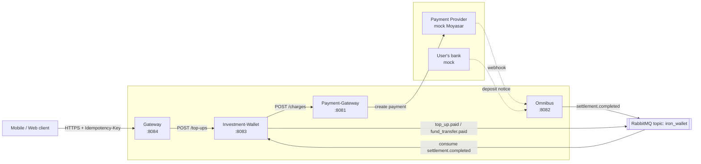
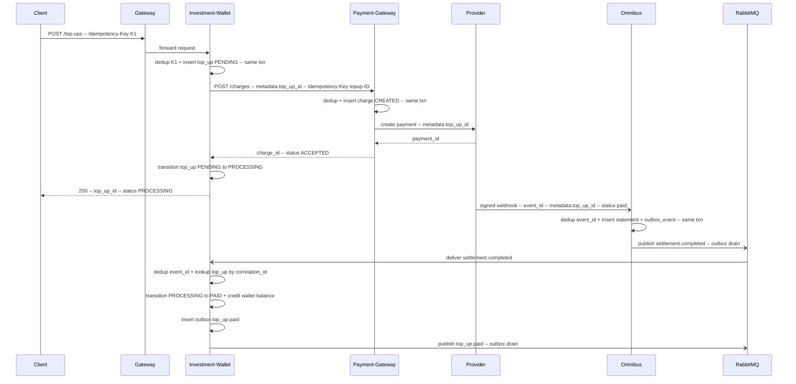
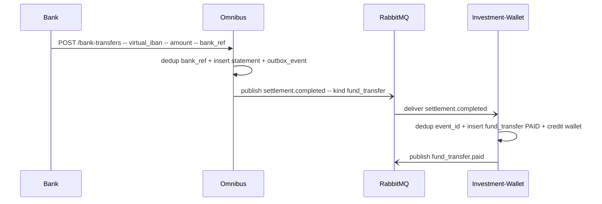

# IronWallet — System Design

Investment wallet POC supporting **Top-Up** (wallet funding via payment provider) and **Fund Transfer** (direct bank deposit via virtual IBAN). Focus: idempotency, concurrency, state management, partial-failure handling across distributed services.

## 1. Services and responsibilities

| Service | Port | DB | Role |
|---|---|---|---|
| Gateway | 8084 | — | Thin edge: auth (stubbed), routing, forwards idempotency key. No business logic, no state. |
| Investment-Wallet | 8083 | `investment_wallet` | Owns wallets and top-up/fund-transfer records. Orchestrates top-up. Consumes settlement events. Publishes state-change events. |
| Payment-Gateway | 8081 | `payment_gateway` | Wraps external payment provider (Moyasar, mocked). Owns `charges` table. |
| Omnibus | 8082 | `omnibus` | Ingests provider webhooks and bank-transfer notifications. Owns statements. Publishes settlement events. |

**Ownership rule:** each service only reads and writes its own DB. Cross-service data moves over HTTP (commands) or RabbitMQ (events).

## 2. Architecture diagram



Sync HTTP for commands. RabbitMQ for state-change events. Every service has its own Postgres-compatible DB in CockroachDB.

## 3. Top-up flow



### 3.1 Correlation

Wallet's `top_up_id` is passed as opaque `metadata` through Payment-Gateway → provider → provider's webhook → Omnibus → published event. Real providers (Moyasar, Stripe) support a `metadata` field exactly for this; we honour the same contract.

When the settlement event arrives at Wallet, the payload includes `correlation_id` (= Wallet's original `top_up_id`), so Wallet looks up the row directly without cross-service queries.

For fund-transfer, correlation is skipped — the event arrives unsolicited, and Wallet creates a fresh `fund_transfer` record keyed by `statement_id`.

## 4. Fund-transfer flow

Entry point: admin endpoint `POST /bank-transfers` on Omnibus stands in for the user's bank. From there the pipeline is identical to top-up's back half.



## 5. Data model (only non-obvious tables)

### 5.1 Per service: `idempotency_keys`

```sql
CREATE TABLE idempotency_keys (
  key              TEXT PRIMARY KEY,
  request_hash     TEXT NOT NULL,
  response_status  INT,
  response_body    JSONB,
  resource_id      UUID,
  state            TEXT NOT NULL CHECK (state IN ('in_progress','completed')),
  created_at       TIMESTAMPTZ NOT NULL DEFAULT now(),
  expires_at       TIMESTAMPTZ NOT NULL
);
```

Dedup semantics:
- Same key + same body + completed → replay stored response.
- Same key + different body → 422 (conflict — client bug).
- Same key + in_progress → 409 (still running).

### 5.2 Investment-Wallet

```sql
CREATE TABLE wallets (
  id            UUID PRIMARY KEY,
  user_id       UUID NOT NULL,
  balance_minor BIGINT NOT NULL DEFAULT 0,   -- money always stored as integer minor units
  currency      TEXT NOT NULL,
  created_at    TIMESTAMPTZ NOT NULL DEFAULT now(),
  updated_at    TIMESTAMPTZ NOT NULL DEFAULT now()
);

CREATE TABLE top_ups (
  id              UUID PRIMARY KEY,
  wallet_id       UUID NOT NULL REFERENCES wallets(id),
  amount_minor    BIGINT NOT NULL,
  currency        TEXT NOT NULL,
  status          TEXT NOT NULL CHECK (status IN ('PENDING','PROCESSING','PAID','FAILED')),
  charge_id       UUID,                        -- payment-gateway reference
  failure_reason  TEXT,
  created_at      TIMESTAMPTZ NOT NULL DEFAULT now(),
  updated_at      TIMESTAMPTZ NOT NULL DEFAULT now()
);
CREATE INDEX ON top_ups (wallet_id, status);

CREATE TABLE fund_transfers (
  id              UUID PRIMARY KEY,
  wallet_id       UUID NOT NULL REFERENCES wallets(id),
  amount_minor    BIGINT NOT NULL,
  currency        TEXT NOT NULL,
  status          TEXT NOT NULL DEFAULT 'PAID',
  bank_reference  TEXT NOT NULL,
  statement_id    UUID NOT NULL,
  created_at      TIMESTAMPTZ NOT NULL DEFAULT now()
);

CREATE TABLE processed_events (                -- inbound event dedup
  event_id     UUID PRIMARY KEY,
  event_type   TEXT NOT NULL,
  processed_at TIMESTAMPTZ NOT NULL DEFAULT now()
);

CREATE TABLE outbox_events (
  id            UUID PRIMARY KEY,
  aggregate_id  UUID NOT NULL,
  type          TEXT NOT NULL,                 -- e.g. top_up.paid
  payload       JSONB NOT NULL,
  occurred_at   TIMESTAMPTZ NOT NULL DEFAULT now(),
  published_at  TIMESTAMPTZ
);
CREATE INDEX ON outbox_events (published_at) WHERE published_at IS NULL;
```

### 5.3 Payment-Gateway

```sql
CREATE TABLE charges (
  id                   UUID PRIMARY KEY,
  amount_minor         BIGINT NOT NULL,
  currency             TEXT NOT NULL,
  provider             TEXT NOT NULL,          -- 'moyasar'
  provider_payment_id  TEXT,
  metadata             JSONB NOT NULL DEFAULT '{}'::jsonb,  -- opaque, includes caller's correlation id
  status               TEXT NOT NULL CHECK (status IN ('CREATED','ACCEPTED','REJECTED')),
  created_at           TIMESTAMPTZ NOT NULL DEFAULT now()
);
```

### 5.4 Omnibus

```sql
CREATE TABLE statements (
  id              UUID PRIMARY KEY,
  kind            TEXT NOT NULL CHECK (kind IN ('top_up','fund_transfer')),
  amount_minor    BIGINT NOT NULL,
  currency        TEXT NOT NULL,
  virtual_iban    TEXT,                        -- for fund transfers
  correlation_id  UUID,                        -- wallet.top_up_id, echoed by provider as metadata
  source_ref      TEXT NOT NULL,               -- provider event_id or bank_ref
  created_at      TIMESTAMPTZ NOT NULL DEFAULT now()
);
CREATE UNIQUE INDEX ON statements (kind, source_ref);

CREATE TABLE processed_webhooks (
  provider     TEXT NOT NULL,
  event_id     TEXT NOT NULL,
  processed_at TIMESTAMPTZ NOT NULL DEFAULT now(),
  PRIMARY KEY (provider, event_id)
);

CREATE TABLE outbox_events (
  id            UUID PRIMARY KEY,
  aggregate_id  UUID NOT NULL,
  type          TEXT NOT NULL,
  payload       JSONB NOT NULL,
  occurred_at   TIMESTAMPTZ NOT NULL DEFAULT now(),
  published_at  TIMESTAMPTZ
);
CREATE INDEX ON outbox_events (published_at) WHERE published_at IS NULL;
```

## 6. State machine (Top-Up)

```
        (client request + idem)
                │
                ▼
            PENDING ─────────── reject: amount invalid ──► (error, no row)
                │
      (Payment-GW ACCEPTED)
                │
                ▼
          PROCESSING ───── (provider failed / timeout) ──► FAILED   (terminal)
                │
       (settlement.completed)
                │
                ▼
              PAID                                                  (terminal)
```

Transitions enforced with `UPDATE ... WHERE id = $id AND status = $expected RETURNING id`. Zero rows returned ⇒ illegal transition ⇒ raise `IllegalStateTransition`.

Terminal states (`PAID`, `FAILED`) never transition out. Re-applying a settlement to `PAID` is a no-op (idempotent at the state-machine level on top of event-level dedup).

## 7. Idempotency strategy

Every external boundary has a dedup key and a dedicated store.

| Boundary | Key | Store |
|---|---|---|
| Client → Wallet | client-provided `Idempotency-Key` header | wallet.`idempotency_keys` |
| Wallet → Payment-GW | derived: `topup-<top_up_id>` | payment_gateway.`idempotency_keys` |
| Provider → Omnibus (webhook) | provider's `event_id` | omnibus.`processed_webhooks` |
| Bank → Omnibus (mock) | `bank_reference` | omnibus.`statements` UNIQUE(kind, source_ref) |
| Omnibus → Wallet (event) | outbox event `id` | wallet.`processed_events` |

All dedup writes happen in the **same DB transaction** as the business write. Cross-service dedup is not shared — each service is self-sufficient.

## 8. Outbox pattern

Both Omnibus and Wallet use the outbox:

1. Business write + `INSERT INTO outbox_events (...)` in one txn → atomic.
2. Background asyncio task (`infra/outbox.py`) polls `WHERE published_at IS NULL LIMIT 100 FOR UPDATE SKIP LOCKED` every 500 ms, publishes to RabbitMQ, sets `published_at`.
3. Publish failures leave `published_at NULL` → retried on next tick.

`FOR UPDATE SKIP LOCKED` means multiple publisher workers are safe if we ever run more than one. For the POC, one publisher per service process.

## 9. RabbitMQ topology

- **Exchange:** `iron_wallet` (topic).
- **Routing keys published:**
  - `omnibus.settlement.completed`
  - `wallet.top_up.paid`
  - `wallet.fund_transfer.paid`
- **Queue consumed for POC:** `wallet.settlements` bound to `omnibus.settlement.*`.
- **DLQ:** `wallet.settlements.dlq` with dead-letter-exchange policy after 5 redeliveries.
- **Ack model:** manual ack after DB commit. Nack on exception → requeue (up to 5) → DLQ.

## 10. Error handling and retries

| Failure | Response |
|---|---|
| Wallet → Payment-GW sync 5xx / timeout | Retry with exponential backoff (tenacity, cap 3). If still failing: keep `top_up` in PENDING, return 503 to client. Settlement webhook (if it arrives) can still complete it. |
| Payment-GW → provider error | Mark `charge` REJECTED, respond REJECTED to Wallet, Wallet marks `top_up` FAILED. |
| Provider webhook signature invalid | 401, do not write. |
| Provider webhook for unknown `top_up` | Record statement as orphan; publish event; Wallet consumer logs warning and DLQs. Manual reconcile. |
| Consumer crashes mid-processing | RabbitMQ re-delivers; processed_events dedup + state-machine guard make re-entry safe. |
| Outbox publish fails | Row stays unpublished; next tick retries. |

## 11. Webhook security

Mock provider signs payloads with HMAC-SHA256 using a shared secret in env. Omnibus verifies header `X-Signature`. Rejected signatures return 401 without writing.

## 12. Mocks

- `MockMoyasarProvider` in Payment-Gateway: returns shape identical to real Moyasar `POST /payments` response. Includes a scheduler that fires a webhook to Omnibus after a short delay.
- `MockBank` is just the `POST /bank-transfers` admin endpoint on Omnibus.

Both sit behind `PaymentProviderPort` / `BankPort` protocols so real impls can be swapped in.

## 13. Edge cases (non-exhaustive)

- Duplicate client request → covered by client idempotency key.
- Webhook arrives before Wallet finished PROCESSING (unlikely but possible with a fast mock) → settlement event finds `top_up` still in PENDING; state-machine guard rejects the `PROCESSING→PAID` transition; consumer nacks with requeue. Eventually Wallet completes PROCESSING and a replay succeeds.
- Webhook delivered twice → `processed_webhooks` dedup.
- Provider confirms but event publish fails → outbox retries.
- Conflicting top-up requests (same wallet, same time) → wallet balance update uses row-level update; Cockroach SERIALIZABLE isolation prevents lost updates.
- Delayed bank transfer → fund transfer simply arrives whenever; no pre-state needed.
- Settlement event with unknown `correlation_id` (no matching `top_up`) → consumer logs, nacks without requeue, message lands in DLQ for manual reconcile. Distinct from "right top_up, wrong state" (which nacks **with** requeue).

## 14. Testing strategy

Scope: ~10 targeted tests, not exhaustive.

- **Unit:** state-machine guard (legal/illegal), idempotency helper (same-body/different-body/in-progress), outbox helper.
- **Integration** (FastAPI TestClient + per-test DB + in-memory broker):
  - Happy-path top-up end-to-end.
  - Duplicate `Idempotency-Key` returns same response.
  - Webhook replay is a no-op.
  - Provider rejection transitions `top_up` to FAILED.
  - Fund-transfer happy path.

## 15. Repo layout additions (per service)

```
repos/<service>/
├── infra/
│   ├── idempotency.py      # dedup helper
│   ├── broker.py           # aio-pika wrapper
│   └── outbox.py           # omnibus + wallet
├── resources/
│   └── <feature>/          # existing convention kept
└── …
```

No cross-service shared library (matches scaffold convention). Small duplication between `infra/` modules is acceptable for a POC.

## 16. Deliverables

1. This design doc + Mermaid diagrams.
2. Excalidraw architecture diagram (`.excalidraw` source + PNG export) committed under `docs/diagrams/`.
3. Working POC reachable via `make up && make install` + one command per service; `examples/*.http` demonstrates flows end-to-end.
4. Short `EDGE_CASES.md` + `FUTURE_WORK.md` stubs pulled from sections 13 and 17.

## 17. Future work (deliberately out of scope)

- Redis as read-through cache in front of idempotency lookups.
- Dedicated outbox-publisher worker per service; leader election for HA.
- Real Moyasar / ANB adapters behind the existing ports.
- AuthN/AuthZ (JWT, per-wallet ACLs).
- Downstream consumers of `wallet.*.paid` events (notifications, audit, analytics).
- Per-service observability (OpenTelemetry traces across HTTP + RabbitMQ).
- Horizontal scale: partition `outbox_events` by aggregate_id; multiple consumers per queue with message-key-based routing.
- Chaos tests (kill consumer mid-process, network partitions).
